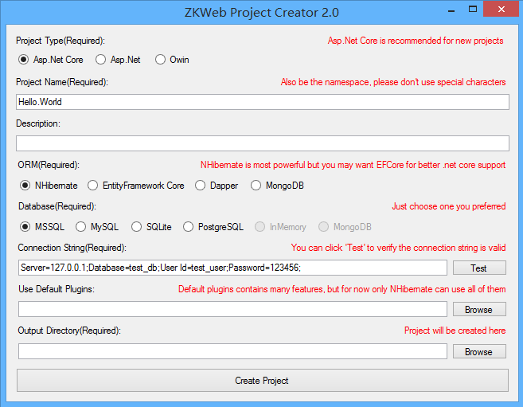

# ZKWeb   

ZKWeb is a flexible web framework support .Net Framework and .Net Core. 

Why create this framework?

- I want a better plugin system, one folder one plugin just like django
- I want a independent mvc framework, because MS change their architecture too often
- I want a powerful template system enough to implemente a visual page editor

## Features

- .Net Core Support
	- Support both .Net Framework and .Net Core
- Plugin System
	- One folder one plugin, each contains everything it needs
	- Automatic compile and reload after source code has changed
	- Based on Roslyn
- Template System
	- Django style overlapping template file system
		- One plugin can just override other plugin's template
	- Template specialization for mobile or pc
	- Area-Widget style dynamic contents system
		- Able to implement a visual page editor based on this feature
	- Per-widget render cache
		- Most times it's better than cache the whole page
	- Based on DotLiquid
- IoC Container
	- Fast
	- Provide IServiceProvider integration
	- ZKWeb own implementation
- Multiple Host Environment
	- Support Asp.Net
	- Support Asp.Net Core
	- Support Owin
	- Use the common abstraction layer can make a plugin support all of this without different code
- Multiple ORM
	- Support Dapper
	- Support EntityFramework Core (with full automatic database migration)
	- Support InMemory
	- Support MongoDB
	- Support NHibernate (with full automatic database migration)
	- Use the common abstraction layer can make a plugin support all of this with less different code
- Localization
	- Multi-language support, with gettext style translation
	- Multi-timezone support
- Caching
	- Policy based isolated cache
		- Isolated by device, request url, and more...
	- Abstraction layer for key-value cache
- File Storage
	- Abstraction layer for file storage
- Testing
	- Console and web test runner
	- Support IoC container overridden
	- Support Http context overridden
	- Support temporary database
- Project Toolkits
	- Project Creator
	- Website Publisher
- Linux support
	- Ubuntu 16.04 LTS 64bit
	- CentOS 7.2 64bit
	- Fedora 24 64bit

## Features from the default plugin collection

- Form generation and validation
- Ajax table generation
- CRUD page scaffolding
- Scheduled Tasks
- Captcha
- Admin Panel
- Automatic pesudo static
- Multi-Currency and Region
- And More...

## Getting Started

In Short: 
Open 'Tools\ProjectCreator.Gui.Windows\ZKWeb.Toolkits.ProjectCreator.Gui.exe' and create the project. 

You can read [README.md](Tools/README.md) under Tools first, for more information please see the documents. 
For now there only chinese documents, if you can't read chinese please ask the questions in 'Issues'. 
For those chinese software engineers, is recommended to join QQ group 522083886 for further discuss. 

## Packages

- ZKWeb: 
- ZKWeb.Hosting.AspNet: 
- ZKWeb.Hosting.AspNetCore: 
- ZKWeb.Hosting.Owin: 
- ZKWeb.ORM.Dapper: 
- ZKWeb.ORM.EFCore: 
- ZKWeb.ORM.InMemory: 
- ZKWeb.ORM.MongoDB: 
- ZKWeb.ORM.NHibernate: 

## Links and License

Plugins: http://github.com/zkweb-framework/ZKWeb.Plugins 
Documents: http://zkweb-framework.github.io (Chinese) 
References: http://zkweb-framework.github.io/cn_v1.0/references/zkweb/ZKWebReferences.chm 

Project Homepage: http://www.zkweb.org 
Demo: http://demo.zkweb.org (Account: demo, Password: 123456) 
MVVM Demo: http://mvvmdemo.zkweb.org (Account: admin, Password: 123456) 

MIT License 
Copyright © 2016~2017 303248153@github 
If you have any license issue please contact 303248153@qq.com. 
