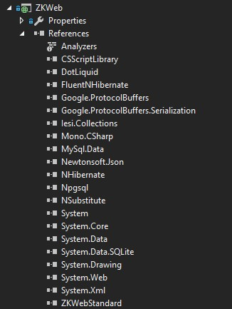
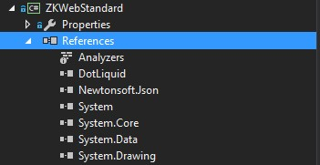
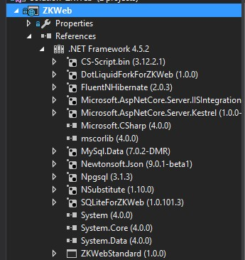
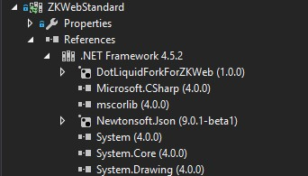

### 0.9.8 Release Note

### 主要更新内容

- 同时提供Asp.Net和Asp.Net Core版本
  - Asp.Net Core版本请看aspnet_core分支
  - Asp.Net Core分支目前会继续更新，在1.0正式版之前会决定是否保留此版本
  - Asp.Net版本和Asp.Net Core版本兼容相同的插件
- 改善部分性能

### 依赖关系

Asp.Net版本 

Asp.Net Core版本 

### 性能数据

2016-06-17 (i7 Q720 1.6Ghz x 4 core 8 threads, ab -n 8000 -c 16, real machine, asp.net core)

- 首页 0.852ms, 0.799ms, 0.801ms
- 商品列表页 0.879ms, 0.740ms, 0.742ms
- 商品详情页 0.941ms, 0.877ms, 0.879ms

2016-06-17 (i7 Q720 1.6Ghz x 4 core 8 threads, ab -n 8000 -c 16, real machine, asp.net)

- 首页 0.674ms, 0.688ms, 0.672ms
- 商品列表页 0.648ms, 0.770ms, 0.645ms
- 商品详情页 0.736ms, 0.756ms, 0.775ms
